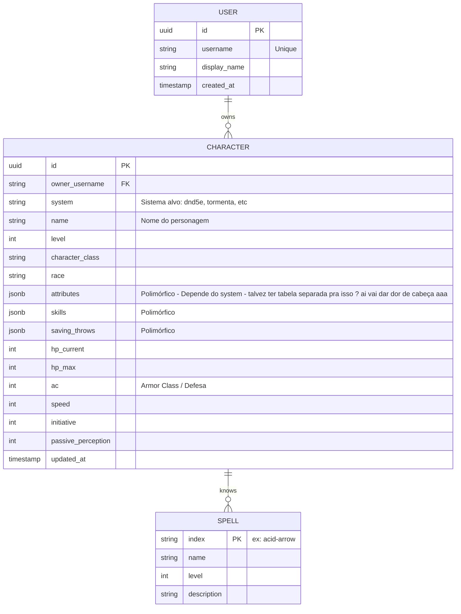

# Database Schema & Relacionamentos

Este documento consolida a arquitetura de dados (modelo relacional lógico) da aplicação RPG World. Mesmo utilizando armazenamento em memória transitoriamente na fase atual, este é o desenho guia para a iminente migração das tabelas para o Supabase (PostgreSQL).

## ER Diagram (Mermaid)

## Escolhas Semânticas e Design

1. **Campos Polimórficos (`jsonb`):** 
   Nós **não** explicitamos as colunas `strength`, `dexterity` direto na tabela abstrata de `CHARACTER`. O projeto lida com múltiplos sistemas; um RPG narrativo pode usar "Músculos" e "Cérebro" invés das 6 estatísticas clássicas do d20. Um objeto JSON permite salvar o estado flexível daquele RPG sem exigir dezenas de colunas esparsas e migrações constantes no SQL.
   
2. **O Identificador Mestre (`system`):** 
   Responsável por funcionar quase que como uma *Discriminator Column* (STI - Single Table Inheritance), ele diz ao backend que classes serializadoras e validadores do `Zod` devem assumir o controle dos dados do campo `jsonb` de atributos e perícias daquele específico registro de dados.
