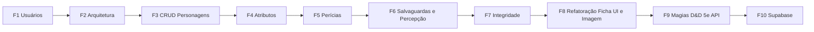

# Prompts por Etapa – Configuração dos Casos de Uso (RPG World)

O projeto atual é **Next.js 16** (React 19, TypeScript, Tailwind), não um monorepo NX. Já existem: tipos em `[src/types/character.ts](src/types/character.ts)`, funções em `[src/lib/rpg-logic.ts](src/lib/rpg-logic.ts)` e o componente `[src/components/AttributeCard.tsx](src/components/AttributeCard.tsx)`. Os prompts abaixo assumem esse stack; se você quiser migrar para NX depois, use um prompt dedicado para “converter este Next.js em workspace NX”.

---

## Requisitos Gerais

1. **Gestão e Escopo de Usuários:** Contas criadas **manualmente** no banco de dados (username/password) para convidados específicos (amigos). Sem sistema aberto de registro no momento.
2. **Limite de Personagens:** Inicialmente, limite estrito de **2 personagens por usuário**.
3. **Arquitetura Expansível:** Abstração de sistemas de RPG (D&D 5e e outros) usando injeção de `system` e separando dados base de dados modulares.
4. **Gestão de Personagens (CRUD):** Fichas completas em uma **UI unificada (Single Page)**, com foto principal (upload de imagem), listagem e edição restritas ao `owner`.
5. **Regras e Integridade de Dados (D&D 5e):** Cálculo rigoroso de atributos, modificadores, perícias, bônus de proficiência e percepção. Valores derivados **somente leitura**.
6. **Integração de Magias (Spells):** Uso da [D&D 5e API](https://www.dnd5eapi.co/) para carregar e adicionar magias (em um drawer ou aba), garantindo estrutura de HTML semântico com suporte nativo à tradução automática do Google Tradutor nas páginas.
7. **Persistência de Dados (Supabase em breve):** Fazer a fundação inicial flexível (ex: usando interfaces/repositórios) para que a migração da persistência em memória/JSON para **Supabase** ocorra suavemente, usando tabelas relacionais e Storage para as imagens.

---

## Decisão de persistência (atual e futuro)

**Prompt F0 – Persistência e “login”**

> No RPG World (Next.js), precisamos definir a camada de persistência. Na fase inicial podemos usar em memória ou JSON para validar regras e UI, mas o **requisito principal** é deixar o sistema preparado para integrarmos o **Supabase** em breve como banco de dados real. Implemente a interface de repositórios/services de modo que a troca de "JSON" por "Supabase" seja isolada. Defina um identificador de usuário e senha (cadastro manual no BD) e aplique um limite de **2 personagens por usuário**.

Use a resposta para alinhar onde ficam usuários e sessão antes das próximas fases, prevendo a integração com o Supabase.

---

## Fase 1 – Gestão de usuários

**Prompt F1.1 – Modelo e persistência de usuário**

> No projeto RPG World (Next.js), implemente a gestão de usuários com: (1) identificador único por username; (2) persistência (conforme decisão da Fase 0: ex. API + SQLite ou localStorage); (3) perfil com nome de exibição opcional (displayName). Garanta que username seja único e que exista uma forma de obter o “usuário atual” (ex.: contexto React ou cookie) para usar nas próximas fases.

**Prompt F1.2 – Reconhecimento e escopo por usuário**

> No RPG World, faça o sistema “reconhecer” o usuário ao ser “logado” (host, parâmetro ou cookie) e garantir que ele visualize apenas os seus dados. Implemente um contexto ou hook (ex.: useCurrentUser) que retorne o usuário atual e use isso para filtrar todas as listagens (ex.: personagens) por owner.

---

## Fase 2 – Arquitetura e modelo de dados expansível

**Prompt F2.1 – Tipagem por sistema e campos modulares**

> No RPG World, prepare o modelo para múltiplos sistemas (D&D 5e, Pathfinder, etc.): (1) toda ficha de personagem deve ter um campo system (ex.: "DnD_5e"); (2) campos universais (nome, nível, dono) ficam na entidade base; (3) campos específicos do sistema (ex.: espaços de magia D&D) devem ficar em estruturas separadas (ex.: characterDataDnD5e) associadas ao personagem. Ajuste os tipos em src/types (Character, etc.) e a estrutura de pastas se necessário (ex.: src/systems/dnd5e/types.ts) sem quebrar o que já existe em character.ts e rpg-logic.ts.

**Prompt F2.2 – Estrutura de pastas para sistemas**

> No RPG World, organize a estrutura de pastas para suportar vários sistemas de RPG: (1) uma pasta ou módulo por sistema (ex.: src/systems/dnd5e/) com tipos, constantes (lista de perícias, atributos) e funções de cálculo; (2) o “core” (usuário, personagem base, ownership) deve permanecer independente do sistema. Mostre a árvore de pastas proposta e mova/refatore o que for D&D 5e para src/systems/dnd5e sem duplicar lógica já existente.

---

## Fase 3 – Gestão de personagens (CRUD)

**Prompt F3.1 – Modelo completo da ficha D&D 5e**

> No RPG World, no módulo D&D 5e, implemente o modelo completo da ficha com: informações básicas (nome do personagem, raça, classe, nível); atributos (STR, DEX, CON, INT, WIS, CHA); status de jogo (pontos de vida atuais/máximos, classe de armadura CA, iniciativa). Todo personagem deve pertencer a um usuário (ownerUsername ou ownerId) e ter system: "DnD_5e". Nível deve ser inteiro >= 1. Ajuste os tipos e o **store em memória (JSON)** para criar e atualizar personagens com esses campos.

**Prompt F3.2 – CRUD de personagens com ownership**

> No RPG World, implemente o CRUD de personagens: criar, listar, editar e excluir. Garanta que: (1) só o dono (usuário atual) possa criar e ver seus personagens; (2) listagem filtrada por usuário atual; (3) edição e exclusão apenas do dono. Use **persistência em memória** (store em JSON; F5 perde os dados). Crie as actions/handlers e as telas ou componentes mínimos para listar, criar, abrir e editar uma ficha.

---

## Fase 4 – Atributos (regras D&D)

**Prompt F4.1 – Regras de atributos e modificador**

> No RPG World, no módulo D&D 5e: (1) atributos são lista fixa STR, DEX, CON, INT, WIS, CHA; (2) valor base entre 1 e 30 (10 = média humana, 20 = limite comum para aventureiros); (3) modificador = floor((valor - 10) / 2). Implemente validação (1–30) e a função de modificador (reuse ou ajuste getModifier em rpg-logic). Garanta que a UI (ex.: AttributeCard) não permita valores fora do intervalo e exiba o modificador calculado.

**Prompt F4.2 – Bônus de proficiência por nível**

> No RPG World, D&D 5e: bônus de proficiência (PB) escala com o nível: começa em +2 no nível 1. Implemente a regra oficial (PB = 2 no nível 1–4, +1 a cada 4 níveis). Centralize em uma função (ex.: getProficiencyBonus(level)) no módulo D&D 5e e use em perícias e salvaguardas.

---

## Fase 5 – Perícias (skills) D&D

**Prompt F5.1 – Catálogo de perícias e vínculo com atributo**

> No RPG World, no módulo D&D 5e, defina o catálogo completo das 18 perícias com vínculo fixo ao atributo: Atletismo→STR; Acrobacia, Furtividade, Prestidigitação→DEX; Arcanismo, História, Investigação, Natureza, Religião→INT; Adestrar Animais, Intuição, Medicina, Percepção, Sobrevivência→WIS; Atuação, Enganação, Intimidação, Persuasão→CHA. Cada perícia no personagem deve ter: referência a essa definição, isProficient (boolean). Persistir apenas isProficient (e expertise se implementar); valor final sempre calculado.

**Prompt F5.2 – Cálculo do valor da perícia e integridade**

> No RPG World, D&D 5e: (1) Se proficiente: valor = modificador do atributo + bônus de proficiência; se não proficiente: só modificador do atributo. (2) Opcional: Expertise = modificador + (PB * 2). (3) O usuário não pode editar o valor final da perícia; só o atributo e os flags (isProficient, expertise). Implemente as funções de cálculo e garanta que a UI mostre apenas valores calculados (sem input numérico para o total da perícia).

---

## Fase 6 – Salvaguardas e percepção passiva

**Prompt F6.1 – Salvaguardas (Saving Throws)**

> No RPG World, D&D 5e: cada um dos 6 atributos tem um teste de resistência (saving throw). O personagem pode ser proficiente em salvaguardas (geralmente definido pela classe). Para cada salvaguarda: valor = modificador do atributo; se proficiente, valor += bônus de proficiência. Implemente o modelo (quais salvaguardas são proficientes) e o cálculo, sem permitir edição manual do valor final.

**Prompt F6.2 – Percepção passiva**

> No RPG World, D&D 5e: Percepção passiva = 10 + modificador de Sabedoria + (bônus de proficiência se for proficiente em Percepção). Implemente como valor derivado (somente leitura) na ficha e exiba na UI.

---

## Fase 7 – Consolidação e integridade

**Prompt F7.1 – Integridade e derivação**

> No RPG World: garanta que nenhum valor derivado (modificador de atributo, valor de perícia, salvaguarda, percepção passiva) seja editável pelo usuário. O usuário edita apenas: valores base dos atributos (1–30), flags de proficiência (e expertise onde houver), PV/CA/iniciativa e dados básicos. Revise tipos, API e UI para que não exista campo “valor final” persistido ou editável para perícias/salvaguardas.

**Prompt F7.2 – Validações e UX**

> No RPG World: aplique validações de negócio na API e no cliente: nível >= 1 inteiro; atributos 1–30; username único; ownership em todas as operações de personagem. Adicione feedback claro (mensagens de erro ou sucesso) nas ações de CRUD e no preenchimento da ficha.

---

---

## Fase 8 – Refatoração UI da Ficha e Foto de Perfil

**Prompt F8.1 – UI Unificada da Ficha e Imagem**

> No RPG World, refatore a exibiçao do personagem (personagem/[id]) para ser uma "Single Page" que concentre todos os Atributos, Perícias, Salvaguardas, PV, CA e Iniciativa em uma visualização densa e organizada (inspirada em fichas reais de D&D). Adicione suporte à **Imagem de Perfil** do personagem (armazenando localmente ou URL/Base64 na versão JSON, com planejamento para migrar para Supabase Storage futuramente).

---

## Fase 9 – Magias (D&D 5e API)

**Prompt F9.1 – Integração com API Externa (Spells Drawer)**

> No RPG World, na UI unificada do personagem, adicione um botão para abrir um "Drawer" ou Aba de "Magias/Spells". Consuma a API externa `https://www.dnd5eapi.co/api/spells` para listar e buscar as magias disponíveis do D&D 5e. Permita "aprender" (adicionar à ficha do personagem) magias específicas. Garanta que a formatação e as tags HTML usadas na renderização do texto proveniente da API permitam que o plugin do **Google Tradutor no Chrome** traduza a página fluidamente para pt-BR.

---

## Ordem sugerida e dependências

- **F1**: usuários criados manualmente; limite de 2 fichas.
- **F2**: modelo com system + campos modulares.
- **F3**: usa usuário (F1) e modelo (F2).
- **F4–F6**: regras D&D em sequência.
- **F7**: revisão de integridade e validações.
- **F8**: refatoração visual completa da página de ficha, englobando F4 a F7 numa tela densa e adição de imagem.
- **F9**: Drawer extra consumindo a D&D API com preparo para Google Tradutor.
- **F10**: fechamento da fase inicial com a transição completa para o Supabase (Database e Storage).

---

## TODOs por etapa

| ID                  | Etapa | Descrição                                                                                               |
| ------------------- | ----- | ------------------------------------------------------------------------------------------------------- |
| f1-users            | F1    | Gestão de usuários: registro manual no banco, store JSON, limitação de 2 personagens por usuário        |
| f2-architecture     | F2    | Arquitetura expansível: campo system na ficha, campos modulares, pasta src/systems/dnd5e                |
| f3-crud             | F3    | CRUD personagens: modelo ficha D&D 5e completo, ownership, listar/criar/editar/excluir em memória       |
| f4-attributes       | F4    | Atributos: intervalo 1–30, modificador, bônus de proficiência por nível, UI AttributeCard               |
| f5-skills           | F5    | Perícias: catálogo 18, vínculo com atributo, isProficient/expertise, valor só calculado                 |
| f6-saves-perception | F6    | Salvaguardas (quais proficientes) + percepção passiva; valores derivados somente leitura                |
| f7-integrity        | F7    | Integridade (não editar derivados) + validações (nível, atributos, username) + feedback UX              |
| f8-refactor-ui      | F8    | Refatoração HTML/CSS: Ficha unificada com atributos/perícias na mesma tela + Foto do Personagem         |
| f9-spells-api       | F9    | Drawer de Magias: Integração https://www.dnd5eapi.co/ pronta para Google Tradutor (pt-BR)               |
| f10-supabase        | F10   | Migração para Supabase: persistência real (Auth Manual, BD e Storage para as imagens)                   |

---

## Observações

- **NX**: o repositório hoje é Next.js único. Para monorepo NX, use um prompt à parte: “Migrar este projeto Next.js para um workspace NX com app rpg-world e libs compartilhadas”.
- **Auth real**: os prompts assumem “login” simples (host/parâmetro/cookie). Para OAuth/email depois, convém um prompt dedicado que integre com o mesmo `username`/`displayName`.
- Reutilize e estenda `[src/types/character.ts](src/types/character.ts)` e `[src/lib/rpg-logic.ts](src/lib/rpg-logic.ts)` conforme as fases; o plano mantém compatibilidade com o que já existe.

